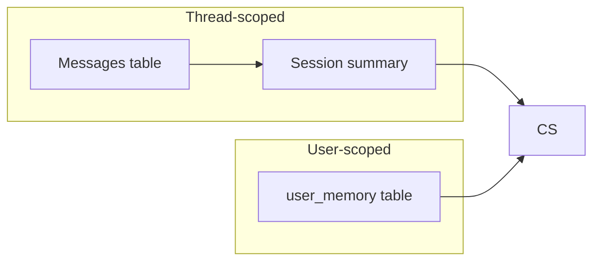
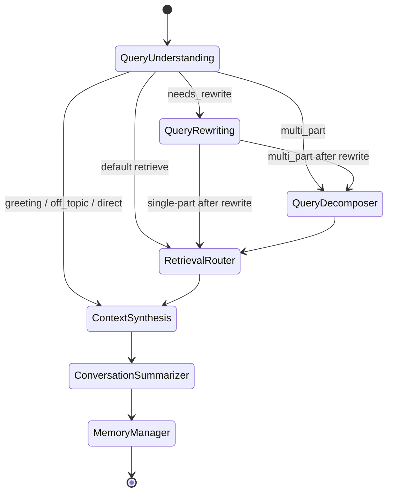

# CogniFlow — System Architecture

## High-level diagram

```mermaid
flowchart TB
  subgraph clients [Clients]
    UI[Streamlit UI]
    CLI[HTTP clients]
  end

  subgraph api [FastAPI]
    R[/api/v1/* routes/]
    RC[Response cache SQLite/memory]
  end

  subgraph graph [LangGraph]
    QU[Query Understanding]
    QR[Query Rewriting]
    QD[Query Decomposer]
    RR[Retrieval Router]
    CS[Context Synthesis]
    SU[Conversation Summarizer]
    MM[Memory Manager]
  end

  subgraph data [Data]
    CH[(ChromaDB\nvector index)]
    SQL[(SQLite\nsessions + LT memory)]
    CK[(Optional SQLite\ncheckpoints)]
  end

  UI --> R
  CLI --> R
  R --> RC
  RC -.->|exact / semantic hit| R
  R --> QU
  QU --> QR
  QU --> QD
  QU --> RR
  QR --> QD
  QR --> RR
  QD --> RR
  RR --> CS
  CS --> SU
  SU --> MM
  RR --> CH
  R --> SQL
  MM --> SQL
  graph --> CK
```

## Memory architecture



- **Thread-scoped**: `sessions` + `messages`; sliding window via recent messages; optional rolling summary in `sessions.summary`.
- **Long-term**: `user_memory` rows extracted by the Memory Manager agent and surfaced to Context Synthesis as `user_memory_context`.
- **LangGraph checkpoints** (optional): SQLite checkpointer keyed by `thread_id = session_id` when `CHECKPOINT_BACKEND=sqlite`.

## Response cache flow

Per-session (+ optional conversation-context fingerprint) lookup runs **before** the LangGraph invoke on `/chat` and `/chat/stream`. Hits skip the orchestrator and still persist messages with an `agent_log` row tagged `response_cache`. Uploading a document invalidates cached entries for that session.

## Agent routing (simplified)

Meta questions about the **conversation** (e.g. user name, **file/document names**, what was uploaded) can **skip retrieval** and go **QueryUnderstanding → ContextSynthesis** so answers come from recent messages without a vector lookup.

Multi-part intents (`multi_part`) route through **Query Decomposer** before retrieval so each sub-query can retrieve independently; results merge by chunk id.


