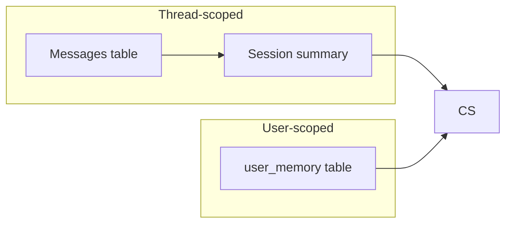
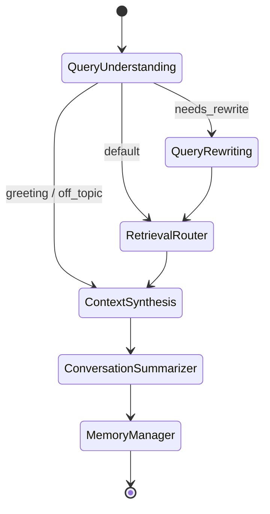

# CogniFlow — System Architecture

## High-level diagram

```mermaid
flowchart TB
  subgraph clients [Clients]
    UI[Streamlit UI]
    CLI[HTTP clients]
  end

  subgraph api [FastAPI]
    R[/api/v1/* routes/]
  end

  subgraph graph [LangGraph]
    QU[Query Understanding]
    QR[Query Rewriting]
    RR[Retrieval Router]
    CS[Context Synthesis]
    SU[Conversation Summarizer]
    MM[Memory Manager]
  end

  subgraph data [Data]
    CH[(ChromaDB\nvector index)]
    SQL[(SQLite\nsessions + LT memory)]
    CK[(Optional SQLite\ncheckpoints)]
  end

  UI --> R
  CLI --> R
  R --> QU
  QU --> QR
  QU --> RR
  QR --> RR
  RR --> CS
  CS --> SU
  SU --> MM
  RR --> CH
  R --> SQL
  MM --> SQL
  graph --> CK
```

## Memory architecture



- **Thread-scoped**: `sessions` + `messages`; sliding window via recent messages; optional rolling summary in `sessions.summary`.
- **Long-term**: `user_memory` rows extracted by the Memory Manager agent and surfaced to Context Synthesis as `user_memory_context`.
- **LangGraph checkpoints** (optional): SQLite checkpointer keyed by `thread_id = session_id` when `CHECKPOINT_BACKEND=sqlite`.

## Agent routing (simplified)


